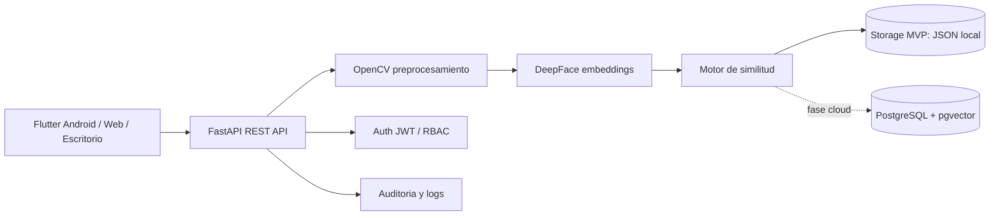

# IA Facial Enterprise MVP

Sistema profesional de reconocimiento facial empresarial, disenado para iniciar en escritorio con Python/FastAPI y escalar despues a Android, nube y SaaS multiempresa.

## Idea del producto

El producto es una plataforma empresarial para registrar, validar e identificar personas mediante rostro, con auditoria, control de acceso por roles y API para clientes web o moviles.

Casos iniciales realistas:

- Control de asistencia o ingreso en oficinas.
- Validacion de identidad para personal interno.
- Check-in rapido para sedes, laboratorios, gimnasios o instituciones.
- Integracion futura con camaras IP, Android, kioscos y dashboards.

## Problema de negocio

Las empresas necesitan verificar identidad sin depender de procesos manuales, listas impresas o tarjetas faciles de perder. El valor real no es "hacer IA", sino reducir fraude, ahorrar tiempo operativo, centralizar evidencia y tener trazabilidad.

El MVP debe responder tres preguntas:

- Puedo registrar una persona con su rostro?
- Puedo comparar una imagen nueva contra registros existentes?
- Puedo exponerlo como API para que web, escritorio o Android lo consuman?

## Arquitectura visual



## Estructura del proyecto

```text
ia_facial/
  backend/                 API Python, IA y reglas de negocio
  edge/                    Agente local de camara para reconocimiento rapido
  frontend/                Futuro dashboard web
  mobile/flutter_client/   Ejemplo de cliente Android con Flutter
  infra/                   Docker, PostgreSQL y despliegue
  docs/                    Arquitectura, roadmap, seguridad y API
```

## Stack recomendado

- Backend: Python 3.11, FastAPI, Pydantic, Uvicorn.
- Computer Vision: OpenCV para lectura, validacion y deteccion inicial.
- IA facial: DeepFace para embeddings y analisis inicial.
- Base de datos MVP: JSON local solo para desarrollo.
- Base de datos profesional: PostgreSQL + pgvector.
- Mobile: Flutter usando HTTP multipart contra FastAPI.
- Infra: Docker Compose local, luego Render/Railway/Fly.io u otro PaaS.

## Inicio rapido en Windows

Desde `C:\SpringProjectsnew\ia_facial\backend`:

```powershell
py -0p
py -3.11 -m venv .venv
.\.venv\Scripts\Activate.ps1
python -m pip install --upgrade pip
pip install -r requirements.txt
uvicorn app.main:app --reload --host 127.0.0.1 --port 8000
```

Nota: DeepFace/TensorFlow es mas estable en Windows con Python 3.11 para este MVP. Si `py -0p` solo muestra Python 3.13, instala Python 3.11 y vuelve a ejecutar los comandos.

Abrir:

- API: http://127.0.0.1:8000
- Swagger: http://127.0.0.1:8000/docs
- Health: http://127.0.0.1:8000/api/v1/health

## Endpoints MVP

- `GET /api/v1/health`
- `POST /api/v1/faces/detect`
- `POST /api/v1/faces/analyze`
- `POST /api/v1/faces/embedding`
- `POST /api/v1/faces/register`
- `POST /api/v1/faces/identify`
- `GET /api/v1/faces/registered`
- `GET /api/v1/attendance/policy`
- `POST /api/v1/attendance/exit-attempts`
- `POST /api/v1/attendance/exit-attempts/with-face`
- `GET /api/v1/attendance/incidents`
- `POST /api/v1/attendance/events`
- `GET /api/v1/attendance/events`

## Flujo Android -> API -> IA

1. Android captura una foto o selecciona una imagen.
2. Flutter envia `multipart/form-data` a FastAPI.
3. FastAPI valida archivo, guarda temporalmente y procesa con OpenCV.
4. DeepFace genera embedding.
5. El backend compara contra embeddings registrados.
6. API responde si hay match, distancia, umbral y candidato.

Ver ejemplo en [mobile/flutter_client/lib/api/face_api_client.dart](C:/SpringProjectsnew/ia_facial/mobile/flutter_client/lib/api/face_api_client.dart).

## Documentacion senior

- [Arquitectura](C:/SpringProjectsnew/ia_facial/docs/ARCHITECTURE.md)
- [API recomendada](C:/SpringProjectsnew/ia_facial/docs/API.md)
- [Roadmap](C:/SpringProjectsnew/ia_facial/docs/ROADMAP.md)
- [Seguridad](C:/SpringProjectsnew/ia_facial/docs/SECURITY.md)
- [Flujo Android](C:/SpringProjectsnew/ia_facial/docs/ANDROID_FLOW.md)
- [Cloud](C:/SpringProjectsnew/ia_facial/docs/CLOUD.md)
- [SaaS](C:/SpringProjectsnew/ia_facial/docs/SAAS.md)
- [Setup Windows](C:/SpringProjectsnew/ia_facial/docs/WINDOWS_SETUP.md)
- [Control laboral inteligente](C:/SpringProjectsnew/ia_facial/docs/WORKFORCE_CONTROL_PLATFORM.md)
- [Asistencia facial en tiempo real](C:/SpringProjectsnew/ia_facial/docs/REALTIME_ATTENDANCE_ARCHITECTURE.md)
