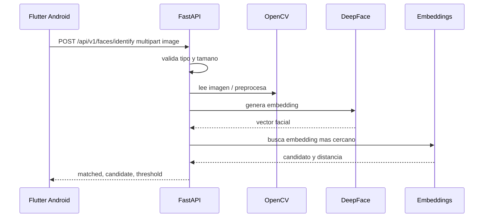
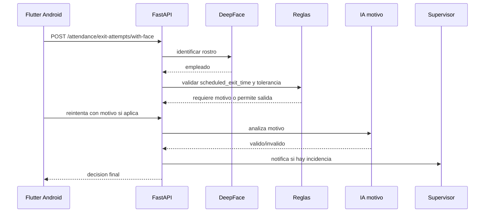

# Flujo Android -> API -> IA

Android no ejecuta Python. Android consume la API Python por HTTP.

## Flujo de salida laboral inteligente

## URL local desde Android

Si pruebas en emulador Android:

- API en PC: `http://127.0.0.1:8000`
- Desde emulador Android: `http://10.0.2.2:8000`

Si pruebas en celular fisico:

- Usa la IP LAN de tu PC, por ejemplo `http://192.168.1.50:8000`
- Ejecuta FastAPI con `--host 0.0.0.0`

## Ejemplo

Ver [face_api_client.dart](C:/SpringProjectsnew/ia_facial/mobile/flutter_client/lib/api/face_api_client.dart).

## Reglas practicas

- Comprimir imagen antes de enviar.
- Evitar enviar video continuo en MVP.
- Enviar una captura clara por intento.
- Mostrar resultado y pedir reintento si no hay rostro.
- No guardar fotos en Android sin consentimiento.
- El horario enviado desde Android debe venir del turno activo, no hardcodeado en la app.
