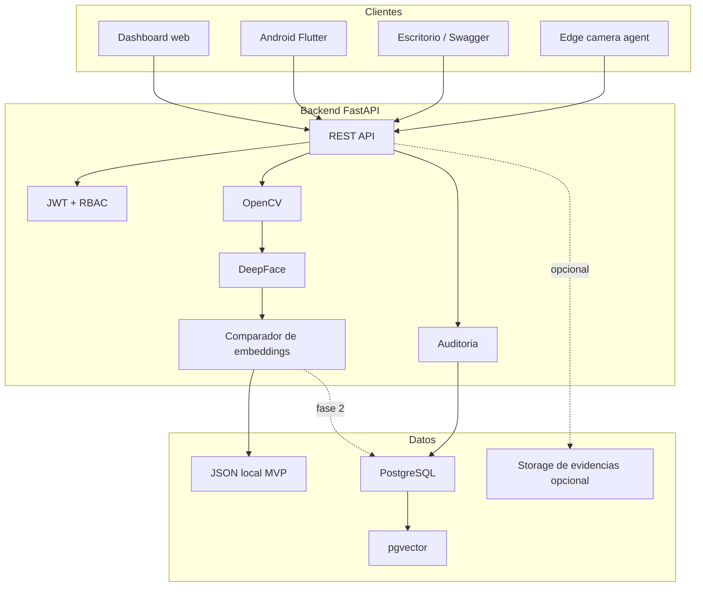

# Arquitectura profesional

## Principio CTO

El MVP debe ser pequeno, medible y reemplazable. No se empieza con microservicios, colas, Kubernetes ni modelos propios. Se empieza con una API limpia, una capa de IA aislada, persistencia simple y contratos REST estables.

## Producto

Plataforma empresarial de reconocimiento facial para registrar personas, generar embeddings, identificar rostros y auditar intentos.

## Componentes

## Capas del backend

- `api`: endpoints HTTP, validacion de entrada y codigos de respuesta.
- `schemas`: contratos Pydantic para request/response.
- `services`: logica de OpenCV, DeepFace y similitud.
- `core`: configuracion.
- `utils`: utilidades pequenas.
- `data`: storage local del MVP.

Cuando el proyecto crezca, se puede agregar:

- `domain`: entidades puras y reglas de negocio.
- `repositories`: persistencia PostgreSQL.
- `use_cases`: flujos como registrar persona, identificar rostro, auditar evento.

## Frontend

El dashboard web no debe ser prioridad el primer dia. Primero se valida la API y la IA desde Swagger. Luego se construye un panel para:

- Registrar personas.
- Ver personas registradas.
- Subir imagen de prueba.
- Ver resultado de identificacion.
- Consultar auditoria.

## Backend

FastAPI expone contratos estables para cualquier cliente. Android no habla con Python directamente; Android habla HTTP/JSON con FastAPI.

## IA

OpenCV se usa para tareas rapidas: lectura de imagen, deteccion inicial, validaciones de tamano y preprocesamiento.

DeepFace se usa para generar embeddings. Un embedding es un vector numerico que representa el rostro. Para identificar, se compara el vector nuevo contra vectores registrados.

## Base de datos

MVP:

- `backend/data/embeddings.json`
- Gratis, simple y facil de inspeccionar.
- No recomendado para produccion.

Fase profesional:

- PostgreSQL para usuarios, personas, organizaciones y auditoria.
- `pgvector` para embeddings.
- Indices vectoriales cuando haya volumen.

## Local vs cloud

Local al inicio:

- Desarrollo Windows.
- Pruebas con Swagger.
- OpenCV y DeepFace.
- JSON local.

Cloud despues:

- API FastAPI en contenedor.
- PostgreSQL administrado.
- Storage de evidencias si hace falta.
- Logs, metricas y backups.

## Escalabilidad

1. Separar almacenamiento de embeddings en PostgreSQL + pgvector.
2. Agregar autenticacion JWT y organizaciones.
3. Separar tareas pesadas si el reconocimiento tarda demasiado.
4. Cachear modelos de DeepFace en el contenedor.
5. Agregar rate limits y colas para cargas masivas.
6. Separar IA en worker si crece el volumen.

## Que hacer primero

1. Levantar FastAPI.
2. Probar `/health`.
3. Probar `/faces/detect` con una imagen.
4. Probar `/faces/register`.
5. Probar `/faces/identify`.
6. Medir latencia y calidad.
7. Recien despues crear dashboard y app Android.

## Que NO hacer primero

- No entrenar un modelo propio.
- No empezar por Android.
- No crear microservicios.
- No guardar fotos sin politica de privacidad.
- No construir SaaS multiempresa antes de validar reconocimiento.
- No prometer precision sin pruebas con datos reales.
