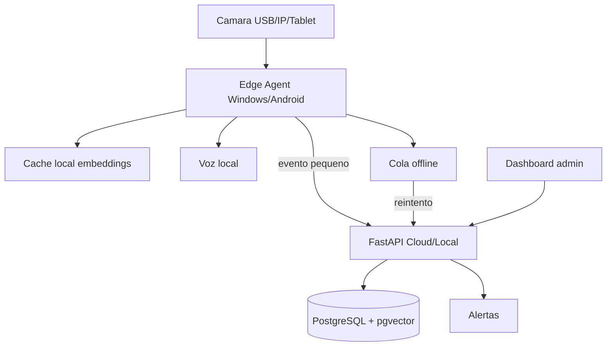
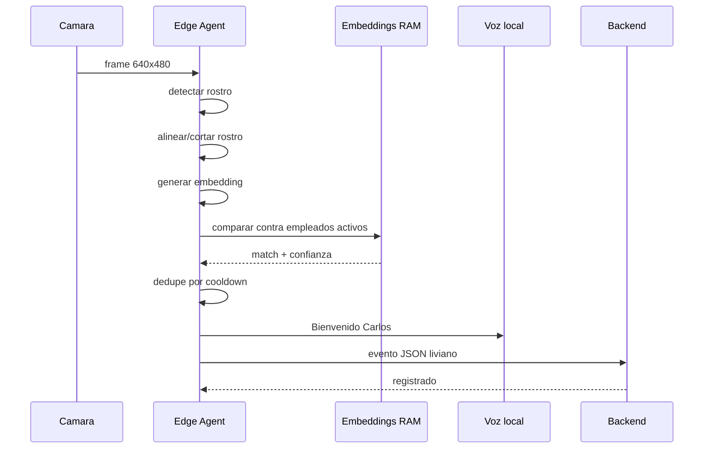

# Asistencia facial en tiempo real

## Decision principal

Para reconocer en menos de 1 segundo, el reconocimiento debe ocurrir localmente en el dispositivo que tiene la camara. El backend no debe recibir video continuo ni imagenes pesadas por cada frame.

La nube administra, audita y sincroniza. El edge device reconoce.

## Arquitectura completa



## Flujo optimizado



## Presupuesto de latencia

Objetivo: menos de 1000 ms por persona.

| Etapa | Objetivo |
| --- | ---: |
| Captura frame | 10-30 ms |
| Deteccion rostro | 20-80 ms |
| Alineacion y crop | 5-15 ms |
| Embedding | 50-250 ms |
| Comparacion 100 empleados | 1-10 ms |
| Dedupe y decision | 1-5 ms |
| Voz local | asincrona |
| Envio backend | asincrono |

El usuario no debe esperar a que la red responda. La asistencia se muestra localmente y se sincroniza.

## Estrategia de embeddings

Enrolamiento:

- Tomar 3 a 5 fotos por empleado.
- Validar calidad: rostro unico, nitidez, iluminacion, frontalidad razonable.
- Generar embeddings.
- Guardar en PostgreSQL + pgvector.
- Sincronizar cache local al edge.

En edge:

- Cargar todos los embeddings activos en RAM.
- Normalizar vectores.
- Comparar con cosine distance o cosine similarity.
- Para 100 a 1000 empleados, busqueda lineal vectorizada es suficiente.
- Para 10k+ empleados, usar indice ANN local o particionar por sede/dispositivo.

Regla practica:

- 100 empleados x 3 embeddings = 300 vectores.
- Comparar 300 vectores en memoria es trivial frente al costo del modelo.
- La latencia esta en deteccion/embedding, no en PostgreSQL.

## Sistema hibrido local + cloud

Local:

- Camara.
- Deteccion facial.
- Embedding.
- Cache de empleados.
- Dedupe.
- Voz.
- Cola offline.

Cloud/backend:

- Usuarios y roles.
- Empleados.
- Enrolamiento.
- Distribucion de embeddings.
- Auditoria.
- Reportes.
- Alertas.
- Configuracion de sedes y dispositivos.

## Como reducir latencia

- No enviar frames al backend.
- Usar resolucion 640x480 o 720p, no 4K.
- Procesar cada N frames, no todos.
- Reutilizar tracking entre frames.
- Cargar modelo una vez al iniciar.
- Mantener embeddings en RAM.
- Usar ONNX Runtime u OpenCV DNN para inferencia local.
- Evitar DeepFace en el loop caliente si tarda demasiado.
- Ejecutar voz y red fuera del camino critico.
- Bloquear duplicados por persona durante 30-60 segundos.

## Stack tecnologico ideal

MVP Windows:

- Python 3.11.
- OpenCV para camara.
- OpenCV DNN u ONNX Runtime para modelos optimizados.
- NumPy para similitud vectorial.
- pyttsx3 para voz offline.
- FastAPI para backend.
- PostgreSQL + pgvector para persistencia profesional.

Backend:

- FastAPI.
- PostgreSQL.
- SQLAlchemy + Alembic.
- pgvector.
- Redis opcional para cache distribuida.
- Worker opcional para alertas.

Android/tablet:

- Flutter para UI.
- Camera plugin.
- En una fase avanzada, inferencia local con TensorFlow Lite u ONNX Runtime Mobile.

## Offline-first

El edge debe operar aunque no haya internet:

1. Cachea embeddings y reglas.
2. Registra evento local.
3. Reproduce voz local.
4. Encola evento si backend no responde.
5. Sincroniza cuando vuelve la red.
6. Resuelve duplicados en backend con `person_id`, `device_id`, `event_type` y ventana temporal.

## Dashboard empresarial

Pantallas:

- Asistencia en vivo.
- Dispositivos conectados.
- Estado de ultima sincronizacion.
- Empleados reconocidos.
- Eventos duplicados ignorados.
- Incidencias.
- Tiempos promedio de reconocimiento.
- Calidad de enrolamiento.
- Configuracion de sedes, turnos y tolerancias.

## Voz automatica

La voz debe ser local para no depender de internet.

Mensajes:

- "Bienvenido Carlos"
- "Salida registrada Carlos"
- "Rostro no reconocido"
- "Intente nuevamente"
- "Consulte con supervisor"

Buenas practicas:

- No bloquear el reconocimiento por la voz.
- Evitar repetir saludo si el empleado sigue frente a la camara.
- Ajustar volumen y velocidad por dispositivo.

## Anti-spoofing basico

MVP:

- Detectar rostro suficientemente grande.
- Verificar nitidez e iluminacion.
- Pedir micro-movimiento si hay sospecha: mirar al centro, girar levemente.
- Rechazar imagen plana muy estatica si no hay variacion.
- Registrar score de calidad.

Fase profesional:

- Modelo anti-spoofing dedicado.
- Deteccion de pantalla/reflejo.
- Camara con profundidad o infrarrojo para escenarios de alto riesgo.
- Auditoria de intentos sospechosos.

## Deteccion duplicada

Edge:

- Cooldown por persona, por ejemplo 45 segundos.
- No reproducir "Bienvenido" repetidamente.

Backend:

- Idempotencia por `device_id + person_id + event_type + ventana`.
- Marcar evento duplicado como `accepted=false`.
- Mantenerlo para auditoria, pero no contarlo como asistencia nueva.

## Manejo de 100+ empleados

100 empleados no es el problema. El problema real es la calidad de captura y el modelo.

Para 100 empleados:

- Cache completa en RAM.
- 2 a 5 embeddings por persona.
- Comparacion vectorizada.
- Un solo dispositivo puede operar.

Para miles:

- Cache por sede.
- Solo empleados activos del dia.
- Particionar por turno.
- Usar ANN local si hace falta.
- Precalentar cache al inicio.

## Base de datos recomendada

- PostgreSQL para datos transaccionales.
- pgvector para embeddings.
- Indices por `organization_id`, `site_id`, `device_id`, `person_id`, `captured_at`.
- HNSW/IVFFlat cuando el volumen de embeddings lo justifique.

## APIs recomendadas

Edge:

- `GET /api/v1/edge/devices/{id}/manifest`
- `GET /api/v1/edge/devices/{id}/embeddings`
- `POST /api/v1/attendance/events`
- `POST /api/v1/edge/devices/{id}/heartbeat`

Backend admin:

- `POST /api/v1/people/{id}/face-enrollments`
- `GET /api/v1/attendance/events`
- `GET /api/v1/devices`
- `GET /api/v1/dashboard/live-attendance`

## MVP realista

1. Registrar 20 a 100 empleados.
2. Generar embeddings.
3. Exportar cache local al edge.
4. Edge reconoce contra cache.
5. Edge reproduce voz.
6. Edge envia evento a FastAPI.
7. Backend evita duplicados.
8. Dashboard muestra eventos.

## Roadmap tecnico

Fase 1:

- Edge Windows con OpenCV.
- Cache JSON local.
- Voz local.
- Endpoint de eventos.

Fase 2:

- Modelo ONNX optimizado.
- Enrolamiento con validacion de calidad.
- PostgreSQL + pgvector.
- Dashboard de asistencia en vivo.

Fase 3:

- Offline queue robusta.
- Manifest por dispositivo.
- Sincronizacion incremental de embeddings.
- Observabilidad de latencia.

Fase 4:

- Android/tablet.
- Inferencia local mobile.
- Anti-spoofing dedicado.
- Alertas empresariales.

Fase 5:

- SaaS multiempresa.
- Multi-sede.
- Alta disponibilidad.
- Auditoria avanzada.
- Politicas de retencion.

## Estructura profesional

```text
ia_facial/
  backend/          API, admin, eventos, auditoria, sincronizacion
  edge/             agente local de camara y reconocimiento rapido
  frontend/         dashboard empresarial
  mobile/           app Flutter futura
  infra/            Docker, PostgreSQL, despliegue
  docs/             arquitectura y guias
```

## Referencias tecnicas

- [OpenCV VideoCapture](https://docs.opencv.org/4.x/d8/dfe/classcv_1_1VideoCapture.html) documenta captura y lectura de frames.
- [OpenCV DNN face detection and recognition](https://docs.opencv.org/4.x/d0/dd4/tutorial_dnn_face.html) incluye `FaceDetectorYN` y `FaceRecognizerSF`.
- [ONNX Runtime Python API](https://onnxruntime.ai/docs/api/python/api_summary.html) permite crear sesiones de inferencia y elegir execution providers.
- [pgvector](https://github.com/pgvector/pgvector) almacena vectores en PostgreSQL y soporta busqueda exacta y aproximada.
- [Flutter camera](https://docs.flutter.dev/cookbook/plugins/picture-using-camera) permite preview y captura en mobile.
- [FastAPI BackgroundTasks](https://fastapi.tiangolo.com/tutorial/background-tasks/) sirve para tareas no criticas despues de responder; para durabilidad real conviene cola persistente.
