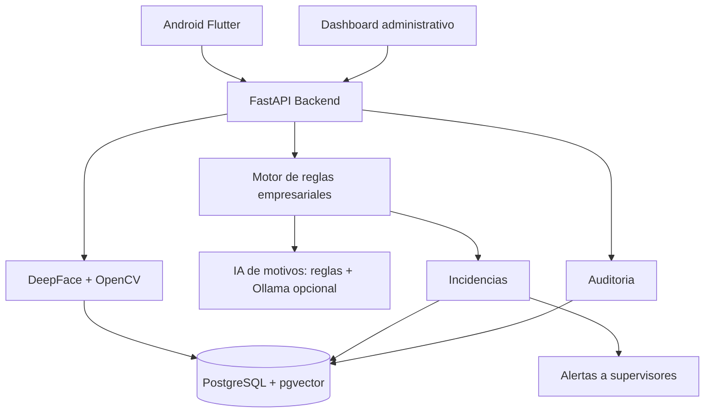
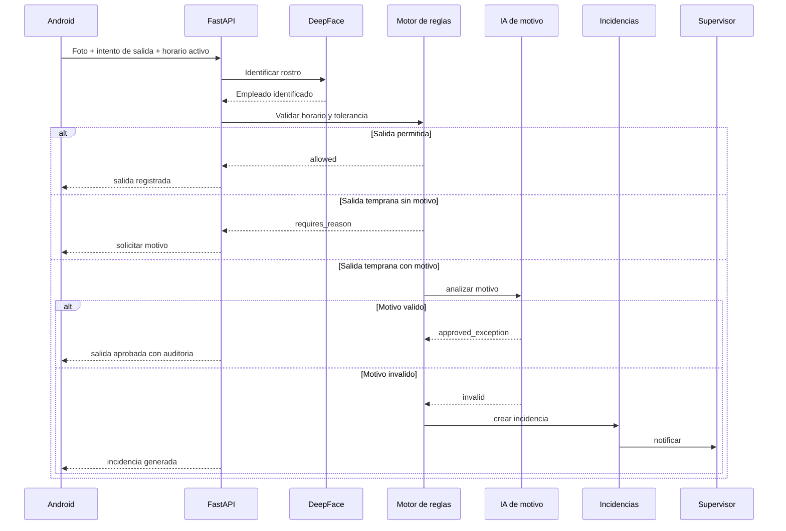

# Plataforma inteligente de control de personal

## Vision de producto

La plataforma no debe venderse como "reconocimiento facial". El producto real es control laboral inteligente: identidad, asistencia, horarios, reglas empresariales, excepciones, incidencias, alertas y comportamiento historico.

## Problema de negocio

Las empresas pierden control cuando el registro de asistencia depende de tarjetas, firmas, supervisores manuales o justificaciones sin trazabilidad. El sistema debe responder:

- Quien intento entrar o salir?
- En que horario debia hacerlo?
- La accion cumple reglas de la empresa?
- Si no cumple, existe un motivo valido?
- Se genero evidencia y notificacion?
- Este comportamiento es aislado o repetitivo?

## Arquitectura completa

## Flujo principal

## Horarios configurables

La hora 22:00 es solo ejemplo. En producto real, el horario se resuelve asi:

1. Politica especifica del empleado.
2. Politica del turno asignado.
3. Politica de la sede.
4. Politica por defecto de la empresa.

El MVP permite enviar `scheduled_exit_time` y `tolerance_minutes` por API. En SaaS, esos valores deben salir de PostgreSQL.

Defaults locales:

- `DEFAULT_SCHEDULED_EXIT_TIME`
- `DEFAULT_EXIT_TOLERANCE_MINUTES`

## Backend

Responsabilidades:

- Identidad facial.
- Validacion de asistencia.
- Motor de reglas.
- Analisis de motivos.
- Generacion de incidencias.
- Auditoria.
- Alertas.
- API para Android y dashboard.

No debe hacer en MVP:

- Microservicios.
- Streaming de video.
- Entrenamiento de modelo propio.
- Facturacion compleja.
- Reconocimiento masivo sin consentimiento.

## Motor de reglas

Entrada:

- Empleado.
- Fecha/hora del intento.
- Turno activo.
- Tipo de evento: entrada, salida, pausa, retorno.
- Tolerancia.
- Motivo escrito.
- Fuente: Android, kiosk, web, API.

Salida:

- `allowed`
- `requires_reason`
- `approved_exception`
- `incident_created`
- `face_not_recognized`

Reglas iniciales:

- Si el empleado sale antes de `scheduled_exit_time`, pedir motivo.
- Si no hay motivo, bloquear y solicitar motivo.
- Si hay motivo, analizar con IA.
- Si el motivo no es valido, crear incidencia y notificar supervisor.
- Si el motivo es valido, permitir salida y guardar auditoria.

## IA de motivos

Fase MVP:

- Clasificador heuristico local.
- Categorias: salud, emergencia, autorizacion, seguridad, motivo insuficiente, ocio, conveniencia.

Fase local avanzada:

- Ollama local con modelo configurado.
- FastAPI llama a `http://localhost:11434/api/generate`.
- La respuesta debe ser JSON estructurado.

Fase SaaS:

- Servicio de analisis desacoplado.
- Prompt versionado.
- Auditoria de decision.
- Revision humana para casos sensibles.

La IA no debe ser autoridad unica. Debe recomendar, explicar y dejar trazabilidad.

## Modelo de base de datos profesional

Entidades:

- `organizations`: empresa cliente.
- `users`: administradores, supervisores y operadores.
- `people`: empleados.
- `work_schedules`: horarios configurables.
- `schedule_assignments`: asignacion de empleados a turnos.
- `face_embeddings`: embeddings faciales.
- `attendance_events`: entradas, salidas e intentos.
- `exit_reason_reviews`: analisis IA del motivo.
- `workforce_incidents`: incidencias laborales.
- `supervisor_alerts`: alertas enviadas.
- `behavior_snapshots`: resumen historico por empleado.

## APIs REST recomendadas

MVP implementado:

- `GET /api/v1/attendance/policy`
- `POST /api/v1/attendance/exit-attempts`
- `POST /api/v1/attendance/exit-attempts/with-face`
- `GET /api/v1/attendance/incidents`

Futuras:

- `POST /api/v1/schedules`
- `POST /api/v1/people/{id}/schedule-assignments`
- `GET /api/v1/attendance/events`
- `POST /api/v1/incidents/{id}/resolve`
- `POST /api/v1/alerts/test`
- `GET /api/v1/behavior/{person_id}`

## Dashboard administrativo

Pantallas necesarias:

- Asistencia del dia.
- Salidas tempranas.
- Incidencias abiertas.
- Historial por empleado.
- Reglas por sede/turno.
- Supervisores y alertas.
- Auditoria.

## Seguridad empresarial

- JWT con roles.
- Aislamiento por `organization_id`.
- Consentimiento biometrico.
- No devolver embeddings al frontend.
- No guardar fotos salvo necesidad legal.
- Cifrado de evidencias.
- Logs sin datos sensibles.
- Rate limit en reconocimiento.
- Revision humana para decisiones disciplinarias.

## MVP realista

1. Registrar empleado con rostro.
2. Identificar rostro desde Android o Swagger.
3. Enviar intento de salida con horario activo.
4. Detectar salida temprana.
5. Solicitar motivo.
6. Analizar motivo con reglas locales.
7. Generar incidencia si aplica.
8. Listar incidencias.

## Escalabilidad

- Mover JSON local a PostgreSQL.
- Guardar embeddings en pgvector.
- Usar colas para notificaciones.
- Separar worker de IA si la latencia crece.
- Cachear modelos DeepFace.
- Agregar observabilidad: latencia, tasa de errores, falsos positivos.
- Multiempresa desde el modelo de datos, no desde el frontend.
